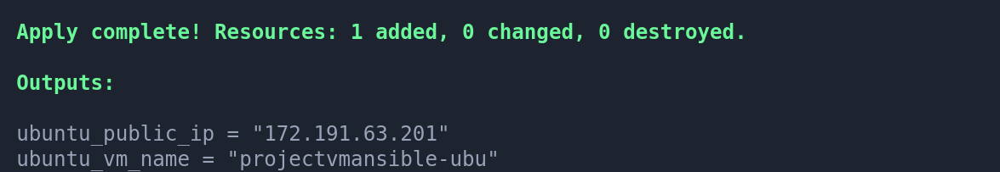
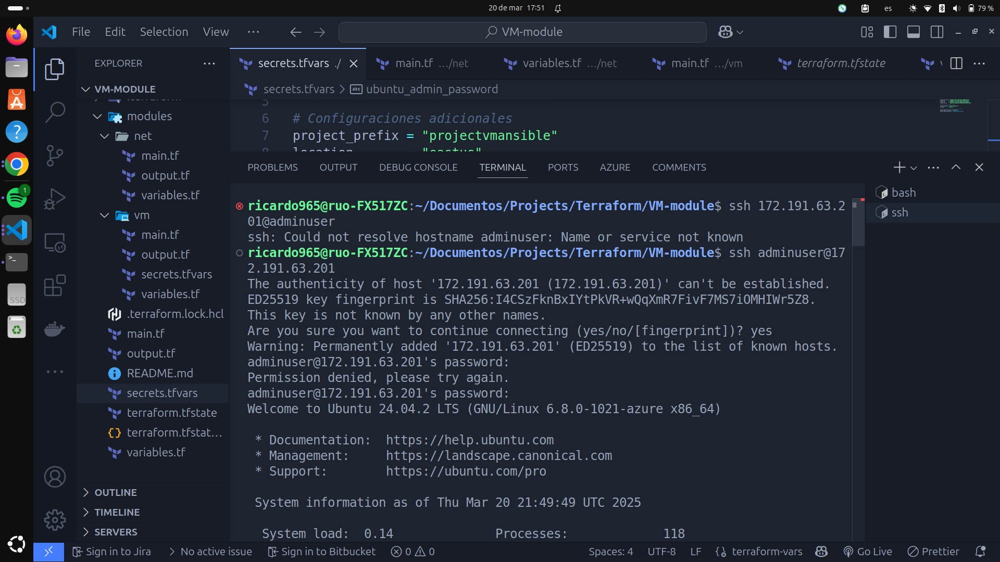

# Documentación del Proyecto Terraform para Desplegar Máquinas Virtuales en Azure

## Introducción

En este documento, describo el proceso que seguí para crear una infraestructura en Azure utilizando Terraform. El objetivo es desplegar una máquina virtual de linux.

---

## **1. Preparación del Entorno**

Antes de empezar con Terraform, aseguré que mi entorno tuviera las herramientas necesarias:

- **Terraform**: Para definir y gestionar la infraestructura como código.
- **Azure CLI**: Para interactuar con Azure desde la línea de comandos.
- **Cuenta de Azure**: Con permisos suficientes para crear recursos.

Para verificar que Terraform estaba instalado, ejecuté:

```bash
terraform -version
```

Y para validar Azure CLI:

```bash
az version
```

---

## **2. Autenticación en Azure**

Para que Terraform pudiera desplegar recursos en Azure, necesitaba autenticación. Opté por usar un **Service Principal**, que creé con Azure CLI:

```bash
az login
az ad sp create-for-rbac --role="Contributor" --scopes="/subscriptions/TU-SUBSCRIPTION-ID"
```

Este comando me devolvió las credenciales necesarias (client_id, client_secret, subscription_id y tenant_id), que guardé en un archivo seguro (`secrets.tfvars`).

---

## **3. Creación del Proyecto Terraform**

### Descripción

Este proyecto utiliza Terraform para desplegar una máquina virtual (VM) junto con su configuración de red en la nube. La infraestructura se organiza en módulos reutilizables para mayor flexibilidad y mantenimiento.

El archivo `main.tf` en la raíz del proyecto es el encargado de orquestar la creación de los recursos, incluyendo el grupo de recursos donde se desplegará toda la infraestructura.

### Estructura del Proyecto

```bash
.
├── main.tf                # Configuración principal, incluye el grupo de recursos
├── modules
│   ├── net                # Módulo de red
│   │   ├── main.tf        # Configuración de red (red, subredes, pip, etc.)
│   │   ├── output.tf      # Salidas del módulo de red
│   │   └── variables.tf   # Variables del módulo de red
│   └── vm                 # Módulo de la máquina virtual
│       ├── main.tf        # Configuración de la VM
│       ├── output.tf      # Salidas del módulo de la VM
│       ├── secrets.tfvars # Variables sensibles (credenciales, contraseñas)
│       └── variables.tf   # Variables del módulo de la VM
├── output.tf              # Definición de outputs generales
├── secrets.tfvars         # Archivo de variables sensibles
├── terraform.tfstate      # Estado de Terraform
├── terraform.tfstate.backup # Backup del estado
└── variables.tf           # Variables globales

4 directorios, 14 archivos
```

## Implementación

1. **Definir Variables**

   - Las variables globales están en `variables.tf`.
   - Las variables específicas de cada módulo están en sus respectivos archivos `variables.tf`.
   - Credenciales y otros valores sensibles están en `secrets.tfvars` (añadir a `.gitignore` si se usa control de versiones).

2. **Estructura Modular**

   - El módulo **`net`** define la red, como subredes, y reglas de firewall.
   - El módulo **`vm`** crea la máquina virtual y la asocia a la red.

3. **Ejecutar Terraform**

   ```bash
   terraform init       # Inicializar el proyecto
   terraform plan       # Previsualizar los cambios
   terraform apply -var-file="secrets.tfvars"  # Aplicar la configuración
   ```

4. **Destrucción de la Infraestructura (opcional)**

   ```bash
   terraform destroy -var-file="secrets.tfvars"
   ```

Este enfoque modular permite reutilizar y escalar la infraestructura fácilmente. 🚀

---

## **5. Inicialización y Aplicación de Terraform**

Con todo configurado, ejecuté los siguientes comandos en el directorio del proyecto:

```bash
# Inicializar Terraform
terraform init

# Validar la configuración
terraform validate

# Revisar el plan de ejecución
terraform plan -var-file=secrets.tfvars

# Aplicar la configuración y crear los recursos
terraform apply -var-file=secrets.tfvars -auto-approve
```

Este proceso tomó unos minutos, y al finalizar, obtuve la IP pública de cada máquina en la salida de Terraform.



---

## **6. Conexión a las Máquinas Virtuales**

Después de la implementación, me conecté a las VMs de la siguiente manera:

- **Ubuntu**:  
  Utilicé **SSH** con la IP pública dada en el output y credenciales definidas en `secrets.tfvars`.



---

## **7. Consideraciones de Seguridad**

Para proteger mis credenciales y la infraestructura:

✔ **Agregué `secrets.tfvars` al archivo `.gitignore`** para evitar subirlo a Git.

El cual debe contener las siguientes variables:

subscription_id = ""
client_id = ""
tenant_id = ""
client_secret = ""

ubuntu_admin_username = ""
ubuntu_admin_password = ""

project_prefix = "proyectovm"
location = "zona"

---

## **8. Eliminación de los Recursos**

Cuando ya no necesité la infraestructura, la eliminé fácilmente con:

```bash
terraform destroy -var-file=secrets.tfvars
```

Este comando borró todos los recursos creados en Azure.

---
